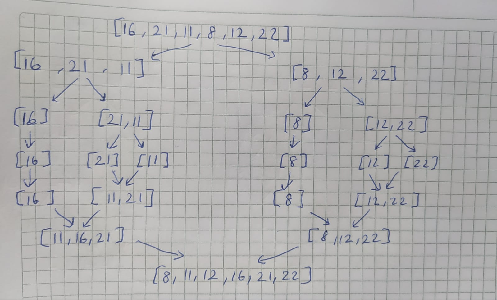

# MERGE SORT PROJESİ

**[16,21,11,8,12,22] -> Merge Sort**

* Yukarıdaki dizinin sort türüne göre aşamalarını yazınız.
* Big-O gösterimini yazınız.

Soru 1: 

Soru 2:
1. her seferinde ikiye bölüyoruz n>n/2>n/4>...>1 
2. buradan 2^x=n, x=logn
3. bu işlemi n kez yapıcaz 
4. bu yüzden n.logn 
5. O(nlogn)